# Hunger Moster

Dalam game ini, player dapat melihat level dengan tampilan gulir ke samping. seluruh level didalam game ini dibangun dengan masing-masing objek berada di tempatnya masing-masing, player hanya bisa melihat level yang sudah di selesainkanya. Game ini bergenre  puzzle untuk usia 10 tahun keatas dan di dalam game 2D ini menceritakan pelarian makhluk seperti monster (Subjek Uji coba) dari laboratorium percobaan bernama Ge-prex. Kami perkenalkan player dengan karakter utama kami ketika kekacauan meletus di lab Ge-prex tempat ia ditahan, dan player harus membantunya mencapai kebebasan dengan memecahkan teka-teki dan mengalahkan musuh di sepanjang jalan.

## Difficulty level
Untuk tingkat kesulitan level didalam game ini hanya 4 level yaitu : 
### Level 1 
Containment Area/Fire zone dimana area monster Gen-I
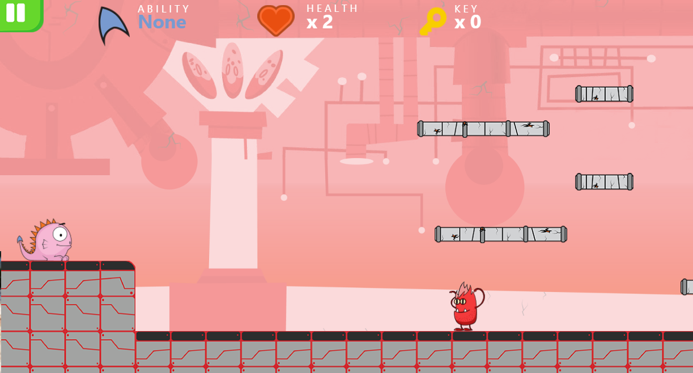
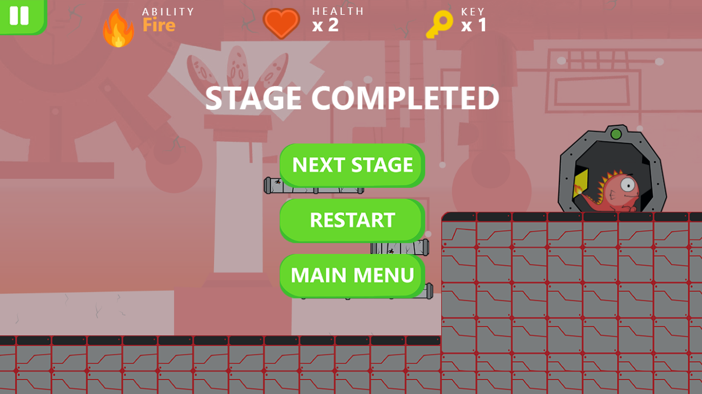

### Level 2 
Ice Zone area untuk monster A-dem
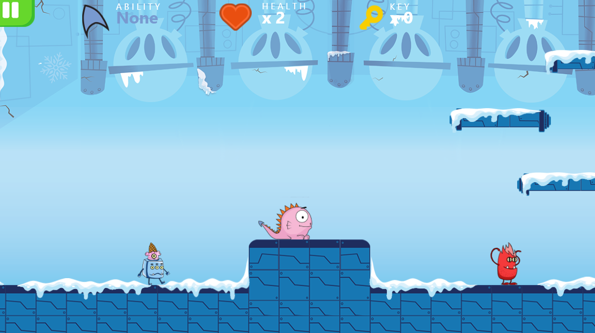
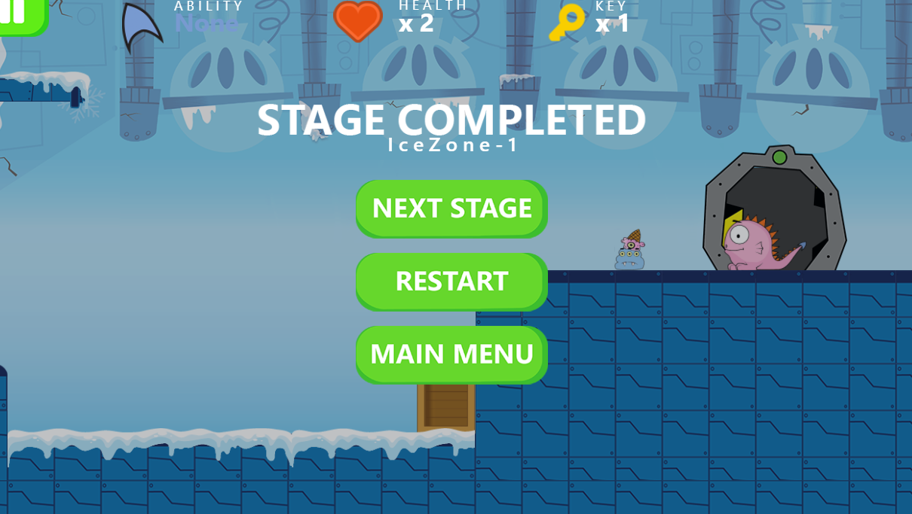

### Level 3 
Electricity/Control Room area untuk monster listrik S trum
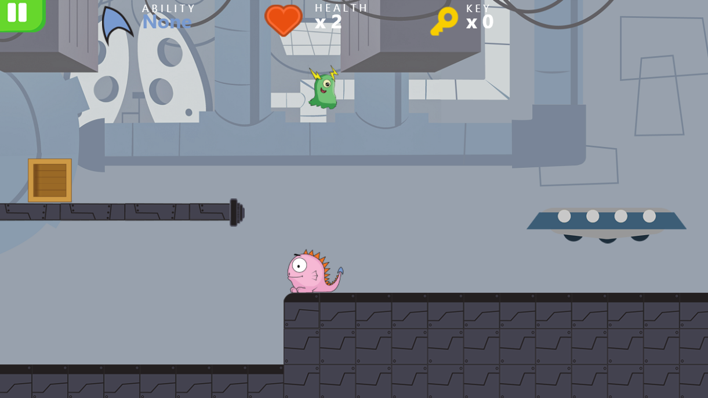
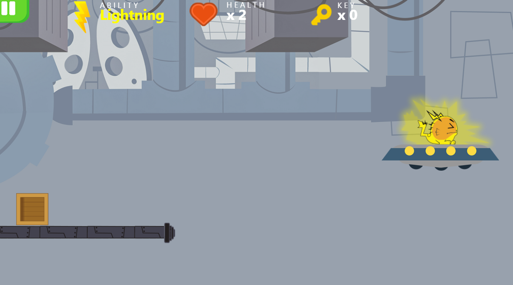
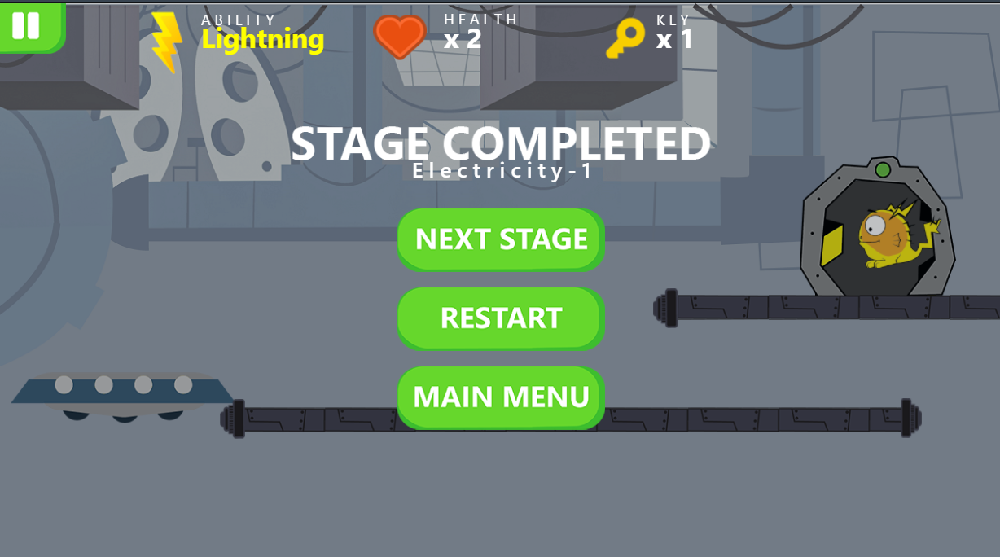

### Level 4
Sewers area untuk monster cairan acid A-sem
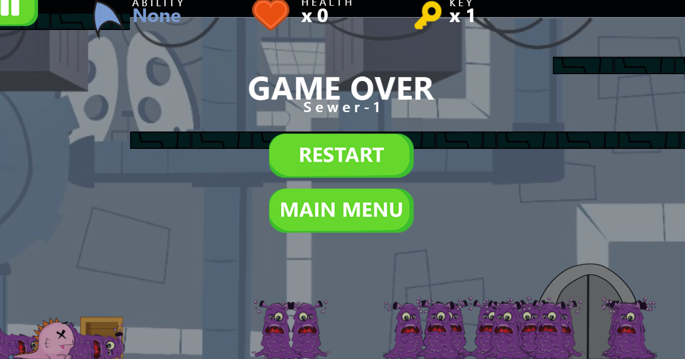
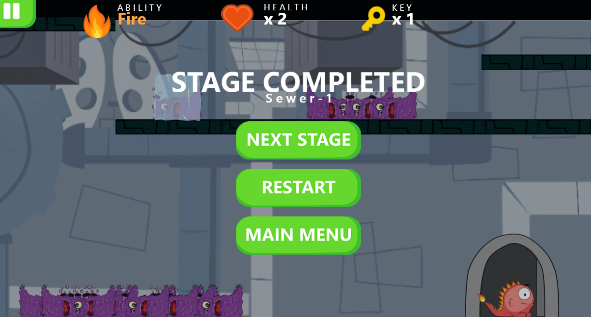

## Control
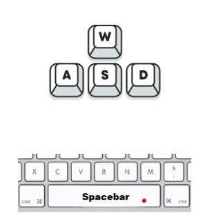
+ W untuk lompat
+ D untuk bergerak ke kanan
+ A untuk bergerak ke kiri
+ S mencerna monster
+ Spacebar untuk memakan monster atau menggunakan kemampuan khusus yang didapat dari monster yang dimakan

## Screenshoots
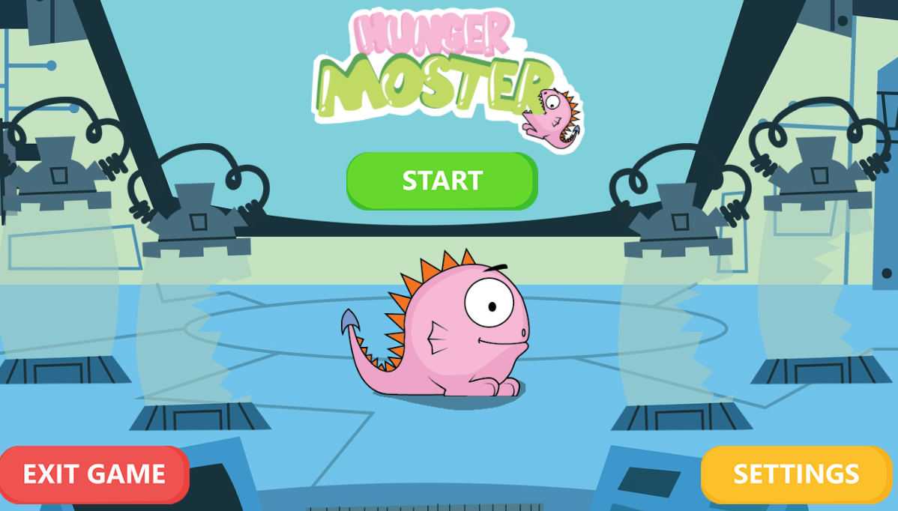
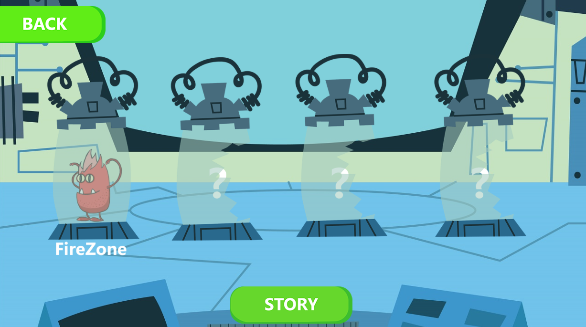
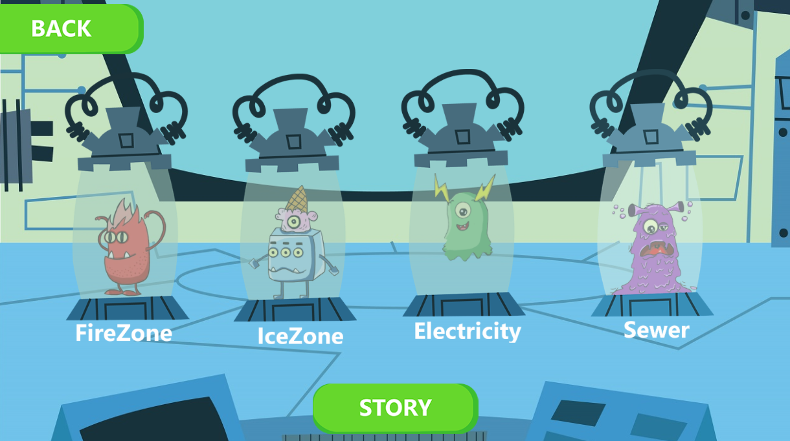
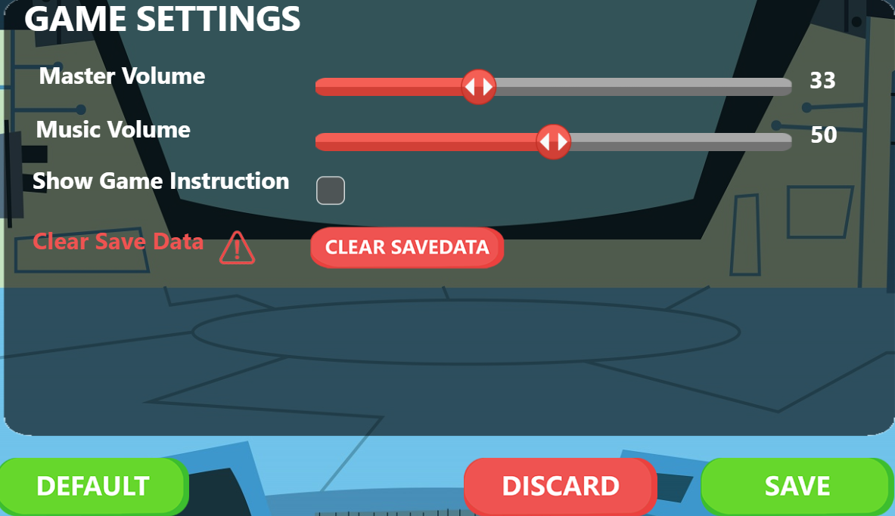

## Tim
- alfarizi : desain grafik
- me : programing
- adi : ide game

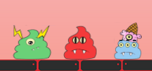